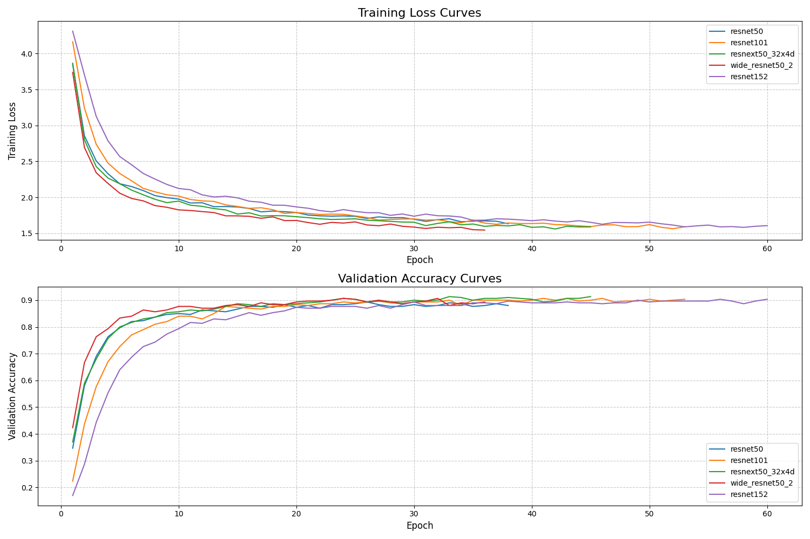

# NYCU Computer Vision 2025 Spring HW1

## Student Information
**Student ID**: 111550150
**Name**: 俞祺譯

## Introduction
This repository contains an image classification pipeline using ResNet-based models with data augmentation techniques such as Mixup and CutMix. The project employs an ensemble of different ResNet variants to enhance accuracy and generalization.

## Features
- Utilizes **ResNet50, ResNet101, ResNeXt50_32x4d, Wide-ResNet50-2, and ResNet152** for an ensemble approach.
- Implements **Mixup and CutMix** for data augmentation.
- Uses **Label Smoothing Loss** to improve generalization.
- **Test-time augmentation (TTA)** is applied during inference.
- **OneCycleLR scheduler** is used for dynamic learning rate adjustment.

## How to Install
### Prerequisites
Make sure you have Python 3.8+ installed and a CUDA-compatible GPU for training acceleration.

### Installation Steps
```bash
# Clone the repository
git clone https://github.com/ianthefish/Computer-Vision-ResNet.git
cd Computer-Vision-ResNet

# Install dependencies
pip install -r requirements.txt

# Run the code
python resnet.py
```

## Dataset Setup
Place the dataset in the `./data` directory:
```
./data
  ├── train
  ├── test
  ├── val
```
Each subdirectory under `train` and `val` should contain images categorized into folders based on class labels.

## Performance Snapshot



The final ensemble performance is **96.24% accuracy on the test set**.

## Results Visualization
Training curves are saved in `./improved_ensemble/training_curves.png`.

